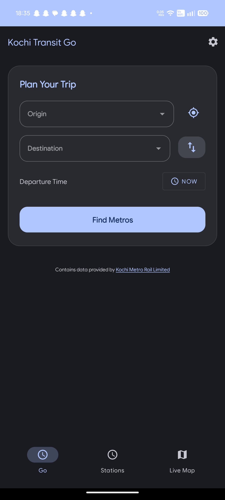
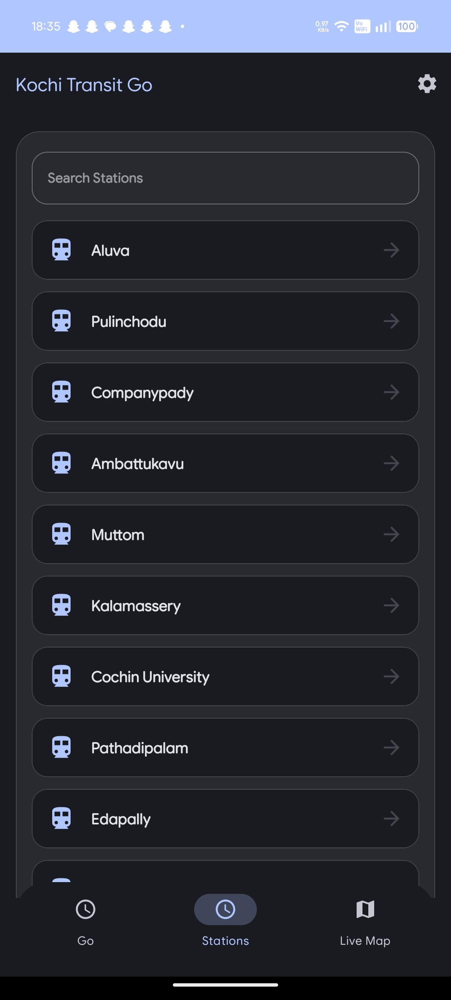
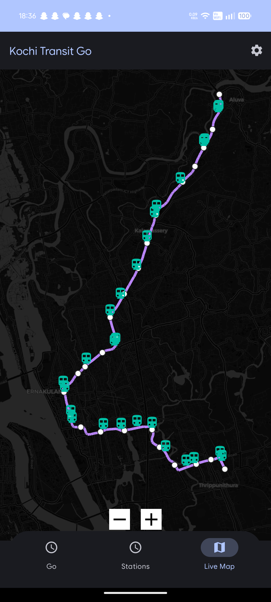
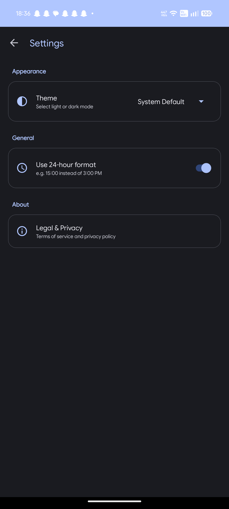

# Kochi Transit Go (Android) 🚇

[](LICENSE)
[]()
[](https://kotlinlang.org/)
[](https://f-droid.org/)

**Kochi Transit Go** is the definitive, privacy-respecting native Android companion for the Kochi Metro system. Built from the ground up to be ultra-fast and 100% offline, it allows commuters to plan transit trips, calculate fares, and locate stations without ever needing an active internet connection.

This project is the native Android app. For the companion website, visit the [Kochi Transit Go Web Portal](https://github.com/agnelfranciso/Kochi-Transit-Go-Web).

---

## 🌟 Core Features

*   **100% Offline Architecture**: All official GTFS schedules are bundled locally. Plan your transit routes deep underground without cell service.
*   **Instant Fare Calculator**: Discover exact trip costs before you reach the station gates.
*   **GPS Station Locator**: Automatically detects the nearest metro station using your device's raw GPS data.
*   **Live Tracker Interface**: See upcoming departures, platform directions, and real-time transit information.
*   **Privacy First**: Zero trackers, zero analytics, zero ads, and no unnecessary permissions. Your location data never leaves your device.
*   **Material 3 Design**: Fully supports Android's dynamic theming (Monet) for a native, premium look and feel.

---

## 📸 App Screenshots

| Route Planner | Station Guide | Fare Calculation | Tracker UI |
| :---: | :---: | :---: | :---: |
|  |  |  |  |

---

## 🛠️ Building from Source

This application is fully FOSS and designed to be compiled easily via Android Studio or Gradle.

### Prerequisites
*   Android Studio (Iguana or newer)
*   Java Development Kit (JDK) 17+
*   Android SDK 34

### Compilation Steps
1. Clone this repository:
   ```bash
   git clone https://github.com/agnelfranciso/Kochi-Transit-Go.git
   ```
2. Open the project folder in Android Studio.
3. Allow Gradle to sync the dependencies.
4. Click **Run** (`Shift + F10`) to deploy to your emulator or physical device.

Alternatively, to build via the command line:
```bash
./gradlew assembleDebug
```

---

## 📜 F-Droid Compliance & Open Source Integrity

This application strictly adheres to the F-Droid inclusion policies:
*   **No Proprietary SDKs**: Zero reliance on Google Play Services (GMS), Firebase Analytics, or AdMob.
*   **Open Source Tooling**: Built exclusively with Free and Open Source libraries (e.g., `osmdroid` for mapping).
*   **Open Data**: Schedules and fares are generated from official Open GTFS data.

---

## 📄 License

This project is licensed under the **MIT License**. See the [LICENSE](LICENSE) file for details.
